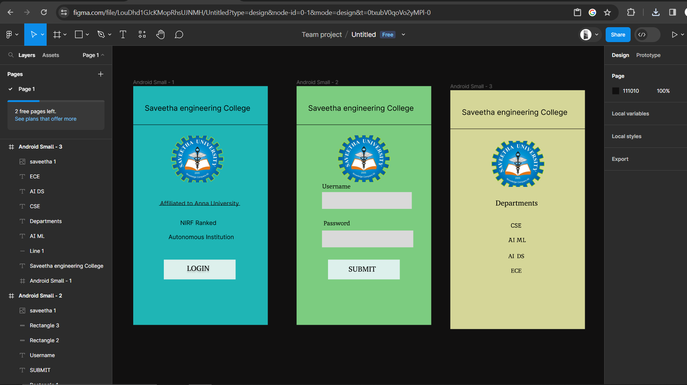

# Ex09 Event Registration Web Application
## Date:07/11/2023

## AIM:
To design, develop and deploy a web application for event registration.

## DESIGN STEPS:

### Step 1:
Create a new frame.

### Step 2:
Select any one preset size of your choice.

### Step 3:
Select the shapes you need.

### Step 4:
Import images as needed.

### Step 5:
Create pages based on your need and link them.

### Step 6:

Validate the HTML and CSS code.

### Step 6:

Publish the website in the given URL.

## DESIGN TOOL:
Figma

## Program:
```

/* Android Small - 1 */

position: relative;
width: 360px;
height: 640px;

background: rgba(33, 196, 196, 0.92);


/* Android Small - 1 */

position: absolute;
width: 360px;
height: 640px;
left: 826px;
top: 17px;

background: #FFFFFF;


/* Saveetha engineering College */

position: absolute;
width: 297px;
height: 86px;
left: 31px;
top: 47px;

font-family: 'Inter';
font-style: normal;
font-weight: 400;
font-size: 20px;
line-height: 24px;

color: #000000;


/* Line 1 */

position: absolute;
width: 360px;
height: 0px;
left: 0px;
top: 104px;

border: 1px solid #000000;


/* Affiliated to Anna University */

position: absolute;
width: 275px;
height: 35px;
left: 72px;
top: 305px;

font-family: 'Inter';
font-style: normal;
font-weight: 400;
font-size: 16px;
line-height: 19px;

color: #1D0A0A;


/* NIRF Ranked Autonomous Institution */

position: absolute;
width: 244px;
height: 60px;
left: 72px;
top: 357px;

font-family: 'Inter';
font-style: normal;
font-weight: 400;
font-size: 16px;
line-height: 19px;

color: #000000;


/* Line 2 */

position: absolute;
width: 217px;
height: 0px;
left: 69px;
top: 320px;

border: 1px solid #000000;


/* Rectangle 1 */

position: absolute;
width: 192px;
height: 53px;
left: 82px;
top: 465px;

background: #DDF0EC;


/* LOGIN */

position: absolute;
width: 203px;
height: 31px;
left: 144px;
top: 476px;

font-family: 'Abyssinica SIL';
font-style: normal;
font-weight: 400;
font-size: 20px;
line-height: 25px;

color: #000000;

text-shadow: 0px 4px 4px rgba(0, 0, 0, 0.25);


/* saveetha 1 */

position: absolute;
width: 148px;
height: 125px;
left: 98px;
top: 133px;

background: url(saveetha.png);


/* Android Small - 2 */

position: relative;
width: 360px;
height: 640px;

background: rgba(134, 220, 138, 0.92);


/* Android Small - 1 */

position: absolute;
width: 360px;
height: 640px;
left: 826px;
top: 17px;

background: #FFFFFF;


/* Saveetha engineering College */

position: absolute;
width: 297px;
height: 86px;
left: 31px;
top: 47px;

font-family: 'Inter';
font-style: normal;
font-weight: 400;
font-size: 20px;
line-height: 24px;

color: #000000;


/* Line 1 */

position: absolute;
width: 360px;
height: 0px;
left: 0px;
top: 104px;

border: 1px solid #000000;


/* Password */

position: absolute;
width: 240px;
height: 30px;
left: 72px;
top: 357px;

font-family: 'Inika';
font-style: normal;
font-weight: 400;
font-size: 16px;
line-height: 21px;

color: #000000;


/* Rectangle 1 */

position: absolute;
width: 192px;
height: 53px;
left: 84px;
top: 465px;

background: #DDF0EC;


/* SUBMIT */

position: absolute;
width: 135px;
height: 27px;
left: 139px;
top: 478px;

font-family: 'Abyssinica SIL';
font-style: normal;
font-weight: 400;
font-size: 20px;
line-height: 25px;

color: #000000;


/* Username */

position: absolute;
width: 166px;
height: 24.84px;
left: 68.14px;
top: 258px;

font-family: 'Inika';
font-style: normal;
font-weight: 400;
font-size: 16px;
line-height: 21px;

color: #000000;

transform: rotate(0.32deg);


/* Rectangle 2 */

position: absolute;
width: 240px;
height: 45px;
left: 68px;
top: 284px;

background: #D9D9D9;


/* Rectangle 3 */

position: absolute;
width: 244px;
height: 45px;
left: 68px;
top: 387px;

background: #D9D9D9;


/* saveetha 1 */

position: absolute;
width: 148px;
height: 125px;
left: 106px;
top: 132px;

background: url(saveetha.png);


/* Android Small - 3 */

position: relative;
width: 360px;
height: 640px;

background: rgba(230, 231, 164, 0.92);


/* Android Small - 1 */

position: absolute;
width: 360px;
height: 640px;
left: 826px;
top: 17px;

background: #FFFFFF;


/* Saveetha engineering College */

position: absolute;
width: 297px;
height: 86px;
left: 31px;
top: 47px;

font-family: 'Inter';
font-style: normal;
font-weight: 400;
font-size: 20px;
line-height: 24px;

color: #000000;


/* Line 1 */

position: absolute;
width: 360px;
height: 0px;
left: 0px;
top: 104px;

border: 1px solid #000000;


/* AI ML */

position: absolute;
width: 241px;
height: 23px;
left: 155px;
top: 391px;

font-family: 'Inika';
font-style: normal;
font-weight: 400;
font-size: 16px;
line-height: 21px;

color: #000000;


/* Departments */

position: absolute;
width: 135px;
height: 27px;
left: 121px;
top: 290px;

font-family: 'Abyssinica SIL';
font-style: normal;
font-weight: 400;
font-size: 20px;
line-height: 25px;

color: #000000;


/* CSE */

position: absolute;
width: 166px;
height: 24.84px;
left: 162.14px;
top: 352px;

font-family: 'Inika';
font-style: normal;
font-weight: 400;
font-size: 16px;
line-height: 21px;

color: #000000;

transform: rotate(0.32deg);


/* AI DS */

position: absolute;
width: 68px;
height: 26px;
left: 155px;
top: 434px;

font-family: 'Abyssinica SIL';
font-style: normal;
font-weight: 400;
font-size: 16px;
line-height: 20px;

color: #000000;


/* ECE */

position: absolute;
width: 65px;
height: 25px;
left: 162px;
top: 473px;

font-family: 'Abyssinica SIL';
font-style: normal;
font-weight: 400;
font-size: 16px;
line-height: 20px;

color: #000000;


/* saveetha 1 */

position: absolute;
width: 150px;
height: 123px;
left: 106px;
top: 136px;

background: url(saveetha.png);
```

## OUTPUT:




## RESULT:
The program to design, develop and deploy a web application for event registration is completed successfully.
